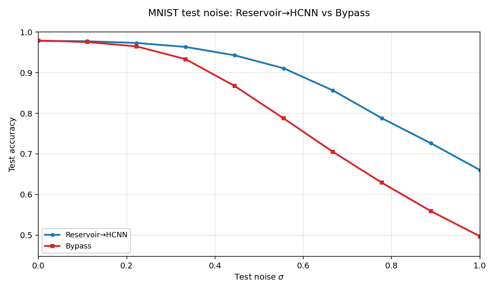

# Hypercube WTF

[](https://github.com/dliptak001/HypercubeWTF/actions/workflows/wheels.yml)
[](https://pypi.org/project/hypercube-wtf/)
[](https://pypi.org/project/hypercube-wtf/)
[](LICENSE)
[](https://en.cppreference.com/w/cpp/23)

HypercubeWTF processes spatial data of the kind presented to a CNN.
It is built from three core classes.

The **WTF** class wraps the other two and manages training and
prediction.

The other two form a pipeline: reservoir → readout.

The **Reservoir** class is a preprocessing stage that consumes input
patterns, drives a short synthetic orbit on a frozen hypercube
reservoir, and returns a field with the same dimensions as the input.

The **Readout** class is a small HypercubeCNN that classifies or
regresses that field.

This is reservoir computing, aimed at data that has no time.

The point of this experiment is to see if a preprocessing stage in
front of HypercubeCNN outperforms HypercubeCNN by itself. HypercubeEtalon
has the same goal; it just does it a slightly different way, using an
**etalon** transit with no time at all, whereas here the preprocessor is
a **reservoir** with synthetic time. The aim is a hypercube preprocessor
effective enough that the readout can be a single layer with a single
convolutional channel and no pooling. Then training is fast, the memory
footprint is small, and little to no architectural engineering is
required for the CNN.

---

<p align="center">
  <strong>HypercubeAI ecosystem</strong><br/>
</p>

<p align="center">
  <a href="https://github.com/dliptak001/HypercubeESN"><strong>HypercubeESN</strong></a>
  &nbsp;·&nbsp;
  <a href="https://github.com/dliptak001/HypercubeCNN"><strong>HypercubeCNN</strong></a>
  &nbsp;·&nbsp;
  <a href="https://github.com/dliptak001/HypercubeHopfield"><strong>HypercubeHopfield</strong></a>
  &nbsp;·&nbsp;
  <a href="https://github.com/dliptak001/HypercubeWTF"><strong>HypercubeWTF</strong></a>
  &nbsp;·&nbsp;
  <a href="https://github.com/dliptak001/HypercubeEtalon"><strong>HypercubeEtalon</strong></a>
  &nbsp;·&nbsp;
  <a href="https://github.com/dliptak001/HypercubeCascade"><strong>HypercubeCascade</strong></a>
  &nbsp;·&nbsp;
  <a href="https://github.com/dliptak001/HypercubeLCN"><strong>HypercubeLCN</strong></a>
</p>

<p align="center">
  📄 Foundational paper:
  <a href="docs/Boolean_hypercubes_as_a_neural_substrate.pdf"><em>Boolean Hypercubes as a Neural Substrate</em></a>
  (D.&nbsp;C.&nbsp;Liptak, 2026)
</p>

HypercubeWTF is an experiment in the **HypercubeAI** project — our quest to
systematically re-implement classical neural architectures on a Boolean
hypercube topology instead of Euclidean grids or random graphs. The central
thesis is “topology-native intelligence”: the hypercube’s algebraic structure
(vertex-transitive symmetry, Hamming geometry, bitwise addressing) can serve
as a first-class computational substrate.

- **A topology you don’t store** — the graph is specified: connectivity is
  implicit in the vertex indices; with a seed and a few config scalars the whole
  reservoir reconstructs mathematically.
- **Perfect homogeneity** — every vertex has the same degree and the same local
  world, so local dynamics mean the same thing everywhere — no structural
  favorites baked in by a random graph.
- **Cheap navigation** — each neighbor is a few bit operations on the vertex
  index, not a pointer chase through a stored edge list, so walks stay
  arithmetic and cache-friendly.
- **Topology-native pairing** — the readout consumes the reservoir’s output with
  zero geometric distortion, and the learned kernels exploit the same locality
  that generated the dynamics. The data never leaves the hypercube it was born
  on.

Each product in the family is a different architecture on that same foundation.

---

## What does WTF stand for?

The design goal was simple: take the HypercubeESN idea — frozen reservoir,
trained head — and aim it at **data that has no time**. There was no lineage to
steal a name from, so the usual naming exercise followed. Nothing stuck. After a
few hours of “maybe this?” and “nah.”, the working monologue devolved to
**what the f\*\*\* do we call this project?**

So we called it that.

**HypercubeWTF**

The monologue won — and the brand gained a little personality :-)

---

## The Reservoir

HypercubeESN and HypercubeCNN are two examples of how solutions can
be built on that substrate. HypercubeESN drives a frozen hypercube
reservoir with a stream and reads the state out along the way.
HypercubeCNN trains a convolutional stack directly on a static cube
field. WTF sits between them: the ESN's reservoir, aimed at the CNN's
data.

The Reservoir is a fork of the HypercubeESN core: one neuron per
vertex, frozen recurrent weights over the cube's edges, a delay line
of M slices, tanh activation, and a frozen initial condition that is
reloaded before every sample. Nothing in it is ever trained.

A stream has a next sample. A still field does not. So WTF invents a
short stretch of synthetic time: it re-addresses the same fixed field
over the cube for T passes and samples the reservoir once at the end.
Geometry and weights stay put; only the registration of the field
moves. The orbit goes something like this.

    Leave the caller's field alone. The drive is built in a scratch
    buffer.

    Reload the reservoir's frozen initial condition.

    LOOP:

        Remap the field by xor with the pass index: vertex v is driven
        by the field value at v xor c.

        Inject that remapping. Step the reservoir: every vertex forms
        the weighted sum of its neighbors and its drive, and writes
        tanh of that sum.

        Increment the pass index.

    GOTO LOOP

    After T passes, the reservoir's live output is the feature field.
    That is what the Readout sees.

Every episode starts from the same frozen initial condition, so the
feature field depends on the input field and nothing else. Bulk
collection fans independent episodes across worker reservoirs that
share the frozen weights.

---

## White noise filter

The reservoir preprocessor behaves as a near unity passthrough at low
to no white noise levels, and offers a meaningful filtering effect
at moderate to high noise levels. The write-up is
[`examples/mnist/WhiteNoiseFilter.md`](examples/mnist/WhiteNoiseFilter.md).



---

## Training-data quality

The same orbit also softens the blow of a degraded training set. With
heavy white noise on the test fields, corrupting the training set
costs the pack-only path about 19 points of test accuracy and the
reservoir path about 8. On clean test fields both paths lose about a
point. The write-up is
[`examples/mnist/TrainingDataQualitySensitivity.md`](examples/mnist/TrainingDataQualitySensitivity.md).

Both studies use MNIST on small cubes because it is handy to pack and
run, not because we are chasing digit accuracy.

---

## Raman baseline extraction (a vibrational spectroscopy application)

The first real-world test is Raman spectra: recover the slow
fluorescence background under sharp molecular peaks without
lifting the baseline into the bands or cutting trenches beneath
them. Polynomials, asymmetric least squares, and ordinary
convolutional nets tend to follow the empty stretches well and then
fail where it matters, under peaks and peak clusters. Analysts have
worked around that for decades with spectrum-specific cleanup,
because no method identifies and extracts a true baseline across a
broad range of peak intensities and baseline characteristics
without occasional, and often frequent, human intervention.

WTF appears to have solved that problem (albeit on synthetic data
only so far).

Trained for 60 epochs on the LCOHard set — 10,000 synthetic LiCoO₂
(lithium cobalt oxide) spectra — it scores a validation RMSE of
4.76 counts on 2,000 held-out spectra whose baselines span
hundreds of counts.

Below are four held-out validation spectra: grey is the raw
spectrum, red the true baseline, blue the extract. For all four
shown here, and for each of the remaining 1996 validation spectra
not shown, baseline identification is, **WITHOUT EXCEPTION**,
quite remarkable.

And it does this with the thin readout the project aims for: one
HypercubeCNN layer, one convolutional channel, no pooling.

In our judgment this at least matches the best of the established
techniques on spectra like these, and very likely beats them.


### Three hosts, one floor

The Reservoir is the whole preprocessor here: one orbit, then the
readout. It is the Cascade's second stage run alone — same seed,
same spectral radius, same history depth, same pass count — and on
spectra like these it is already enough. The etalon-only sibling
([HypercubeEtalon](https://github.com/dliptak001/HypercubeEtalon))
scores 4.77 on the same split; the two-stage
([HypercubeCascade](https://github.com/dliptak001/HypercubeCascade))
scores 4.82. Three preprocessors that share no mechanism — a transit,
an orbit, and the two in series — carry the same one-layer,
one-channel readout to the same floor, and their overlays are
indistinguishable.

Real spectra, however, are not nearly this clean. Low laser power,
short integration times, and weak scatterers all put noise on the
spectrum, and that is where a baseline extractor has to earn its
keep.

That is where the hosts should separate. The MNIST white-noise study
([`examples/mnist/WhiteNoiseFilter.md`](examples/mnist/WhiteNoiseFilter.md))
found this reservoir a near-unity passthrough on clean fields and a
filter that holds accuracy as the noise rises; the Cascade's study
found the two-stage path pulling ahead of the etalon alone from
moderate noise up.

That is the next experiment.

The overlay and the training profile are in
[`examples/RamanBaselineExtraction/`](examples/RamanBaselineExtraction/README.md).

Runnable programs live under [`examples/`](examples/README.md).

The Raman spectra themselves (about 1 GB) are not in this repository.

---

## SDKs

**C++** — link `HypercubeWTFCore`, include `WTF.h`, work with `WTF`.
The guide is [`docs/CPP_SDK.md`](docs/CPP_SDK.md).

**Python** — `pip install hypercube-wtf`, import `hypercube_wtf`, work
with `WTF`. The guide is [`docs/Python_SDK.md`](docs/Python_SDK.md);
the PyPI-facing package readme is [`python/README.md`](python/README.md).
Bindings build from this repo via `pip install ./python` (pybind11 +
scikit-build; does not use the CLion `cmake-build-*` trees).

```python
import numpy as np
import hypercube_wtf as hw

wtf = hw.WTF(dim=7, history_depth=4, T=100, ic_seed=2,
             readout_num_outputs=4, readout_task="classification",
             readout_epochs=80)
wtf.fit(fields_train, labels_train)          # (count, N) float32, (count,) int
cls = wtf.predict_class(fields_test[0])
```
